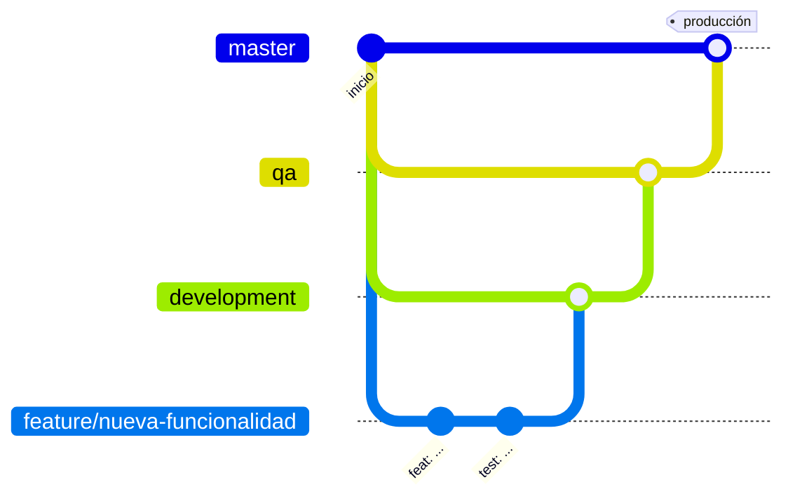

# Guía de contribución · Flujo CAPEX-OPEX

Esta guía define cómo se gestionan las ramas, los commits y la integración de cambios en el repositorio, para que todo cambio llegue a producción de forma ordenada, revisada y trazable.

---

## 1. Estrategia de ramas

### Ramas permanentes

| Rama | Propósito | Recibe cambios desde |
|---|---|---|
| `master` | Código en **producción**. Siempre estable. | `qa` y `hotfix/*` |
| `qa` | Código en **pruebas** antes de producción. | `development` |
| `development` | **Integración** de los desarrollos terminados. | `feature/*` y `hotfix/*` |

### Ramas temporales

| Tipo | Se crea desde | Se integra en | Uso |
|---|---|---|---|
| `feature/<descripcion>` | `development` | `development` | Nuevas funcionalidades, mejoras y ajustes planeados |
| `hotfix/<descripcion>` | `master` | `master` **y** `development` | Correcciones urgentes sobre lo que está en producción |

Las ramas temporales **se eliminan** después de integrarse. El historial de sus commits se conserva en las ramas permanentes.

**Nombres:** en minúscula, con guiones y descriptivos. Ejemplos:
- `feature/limpieza-secretos`
- `feature/actualizar-dependencias`
- `hotfix/arreglos-pendientes`

### Flujo de trabajo



**Desarrollo normal (`feature`)**

```bash
git checkout development
git pull
git checkout -b feature/descripcion
# ... cambios y commits ...
git push -u origin feature/descripcion
# Pull Request: feature/descripcion → development
```

**Paso a pruebas y a producción**

1. Pull Request `development` → `qa`. Se despliega en el ambiente de QA y se valida.
2. Si QA aprueba: Pull Request `qa` → `master`. Se despliega en producción.

**Corrección urgente (`hotfix`)**

```bash
git checkout master
git pull
git checkout -b hotfix/descripcion
# ... corrección y commits ...
git push -u origin hotfix/descripcion
# Pull Request 1: hotfix/descripcion → master
# Pull Request 2: hotfix/descripcion → development
```

El hotfix se integra también en `development` para que la corrección no se pierda en el siguiente paso a producción.

### Reglas

- **No** se hacen commits directos sobre `master`, `qa` ni `development`: todo cambio entra por **Pull Request**.
- Antes de crear un Pull Request, el código debe **compilar** y las **pruebas deben pasar**.
- Cada Pull Request tiene un título con el formato de commits convencionales y una descripción de los cambios y de cómo se verificaron.

---

## 2. Convención de commits

Se usa la convención **Conventional Commits**:

```
tipo(ámbito opcional): descripción breve en minúscula
```

### Tipos

| Tipo | Cuándo se usa | Ejemplo |
|---|---|---|
| `feat` | Nueva funcionalidad | `feat(acta-cierre): agregar entregables al acta` |
| `fix` | Corrección de un error | `fix(usuarios): validar permisos al editar el área` |
| `docs` | Solo documentación | `docs(readme): agregar instrucciones de instalación` |
| `refactor` | Cambio de estructura sin cambiar el comportamiento | `refactor(permisos): extraer validación de compañía` |
| `test` | Agregar o corregir pruebas | `test(auth): agregar pruebas de dominio corporativo` |
| `chore` | Mantenimiento: dependencias, configuración, limpieza | `chore(deps): actualizar nodemailer` |
| `style` | Formato del código, sin cambios de lógica | `style: aplicar formato de prettier` |
| `perf` | Mejora de rendimiento | `perf(proyectos): agregar índice a la consulta` |
| `ci` | Pipeline de integración continua | `ci: agregar ejecución de pruebas` |

### Ámbitos sugeridos

`auth`, `permisos`, `usuarios`, `proyectos`, `solicitud-inversion`, `ordenes-internas`, `control-cambios`, `acta-cierre`, `pendientes`, `notificaciones`, `backup`, `catalogos`, `frontend`, `backend`, `deps`, `config`, `readme`.

### Buenas prácticas

- Un commit = **un cambio lógico**. Si un commit necesita la palabra "y" para describirse, probablemente deberían ser dos.
- La descripción va en **minúscula**, en **imperativo** ("agregar", "corregir", "eliminar") y sin punto final.
- Si el cambio necesita más explicación, se agrega un cuerpo después de una línea en blanco:

```
fix(notificaciones): exigir RABBITMQ_URL y eliminar credenciales por defecto

Antes, si la variable no existía, se usaban las credenciales guest:guest.
Ahora el servidor no arranca y muestra un error claro.
```

---

## 3. Antes de abrir un Pull Request

**Backend**

```bash
npx prisma generate
npx tsc --noEmit
npm run lint
npm run test
```

**Frontend**

```bash
npm run lint
npm run build
```

Además, probar en local la funcionalidad modificada con los usuarios de prueba (DevSwitcher).

---

## 4. Variables de entorno y secretos

- Los archivos `.env` **nunca** se suben al repositorio.
- Si se agrega una variable nueva, se documenta en la plantilla (`.env.example` o `.env.production.example`) **sin valores reales**, y en la sección *Configuración* del README.
- No se escriben contraseñas, tokens ni credenciales en el código, ni siquiera como valor por defecto.
