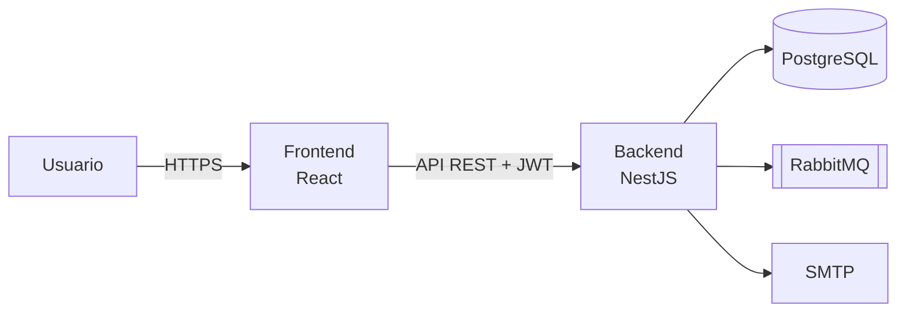

# Flujo CAPEX-OPEX

Aplicativo web para la **solicitud, aprobación y control de los proyectos de inversión (CAPEX / OPEX)** de la compañía. Reemplaza la herramienta anterior construida en Lotus Domino y reúne todo el ciclo de vida de un proyecto en un solo lugar: **Solicitud de Inversión → Órdenes Internas → Controles de Cambio → Acta de Cierre**.

## Componentes

| Carpeta | Componente | Documentación |
|---|---|---|
| [`backend/`](backend/) | API REST (NestJS, PostgreSQL, RabbitMQ) | [README del backend](backend/README.md) |
| [`frontend/`](frontend/) | Aplicación web (React, Vite, Material UI) | [README del frontend](frontend/README.md) |

## Arquitectura general



## Inicio rápido (desarrollo local)

```bash
# 1. Variables para Docker (PostgreSQL y RabbitMQ)
cp .env.example .env          # completar usuarios y contraseñas

# 2. Levantar la base de datos y RabbitMQ
docker compose up -d db rabbitmq

# 3. Backend → ver backend/README.md
# 4. Frontend → ver frontend/README.md
```

## Archivos de la raíz

| Archivo | Uso |
|---|---|
| `docker-compose.yml` | Levanta PostgreSQL, RabbitMQ y el backend |
| `.env.example` | Plantilla de variables para Docker Compose |
| `restore-db.ps1` | Restaura la base de datos desde un respaldo (sobrescribe los datos actuales) |
| `CONTRIBUTING.md` | Estrategia de ramas y convención de commits |

## Cómo contribuir

Ver [CONTRIBUTING.md](CONTRIBUTING.md): estrategia de ramas (`master`, `qa`, `development`, `feature/*`, `hotfix/*`) y convención de commits.
