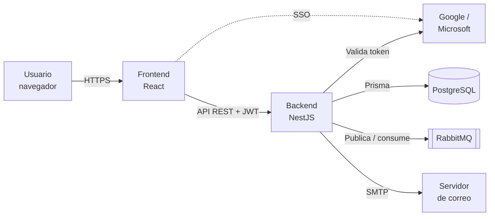
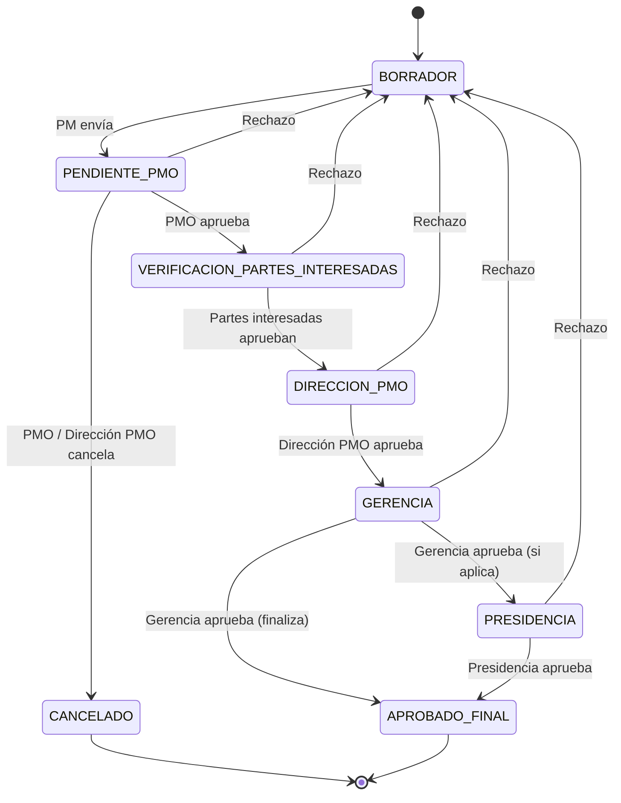
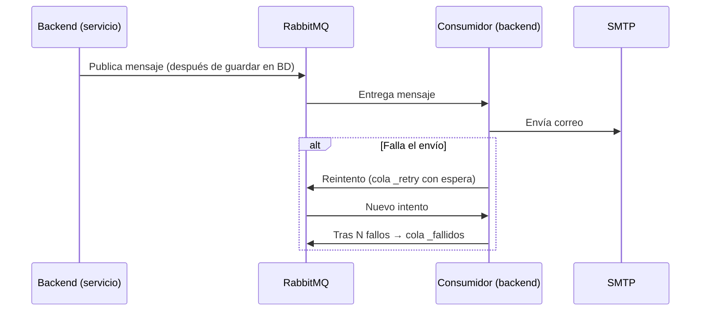
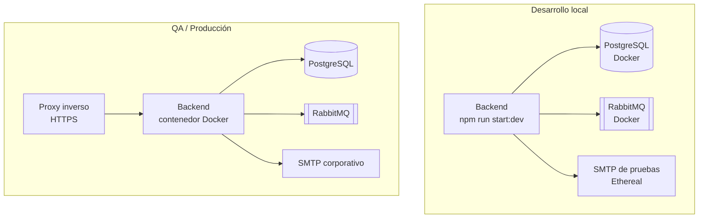

# Flujo CAPEX-OPEX · Backend (API REST)

API del aplicativo **Flujo CAPEX-OPEX**, que gestiona la solicitud, aprobación y control de los proyectos de inversión de la compañía.

---

## Tabla de contenido

1. [Descripción de la aplicación](#1-descripción-de-la-aplicación)
2. [Introducción](#2-introducción)
3. [Tecnologías empleadas](#3-tecnologías-empleadas)
4. [Librerías usadas](#4-librerías-usadas)
5. [Arquitectura de la aplicación](#5-arquitectura-de-la-aplicación)
6. [Diagramas de la solución](#6-diagramas-de-la-solución)
7. [Arquitectura de ambientes](#7-arquitectura-de-ambientes)
8. [Arquitectura de servicios](#8-arquitectura-de-servicios)
9. [Pruebas automatizadas](#9-pruebas-automatizadas)
10. [Imágenes](#10-imágenes)
11. [Ejemplos de código](#11-ejemplos-de-código)
12. [Instalación](#12-instalación)
13. [Configuración](#13-configuración)
14. [Errores conocidos](#14-errores-conocidos)
15. [Autores](#15-autores)

---

## 1. Descripción de la aplicación

El backend expone una **API REST** que centraliza el ciclo de vida completo de un proyecto de inversión:

| Proceso | Qué permite |
|---|---|
| **Solicitud de Inversión (SI)** | Registrar el proyecto (presupuesto, flujo de caja, metas, evaluación financiera, partes interesadas) y aprobarlo por etapas. |
| **Órdenes Internas (OI)** | Crear las órdenes internas del proyecto aprobado. Control de Gestión asigna el número de OI, las aprueba y las cierra. |
| **Control de Cambios (CC)** | Solicitar y aprobar cambios de alcance, tiempo o presupuesto de un proyecto. |
| **Acta de Cierre (AC)** | Cerrar formalmente el proyecto con sus valores reales, metas alcanzadas y entregables. |
| **Proyectos** | Consultar proyectos, su trazabilidad completa y aplazarlos. |
| **Pendientes** | Bandeja con los procesos que esperan acción del usuario. |
| **Usuarios y roles** | Administrar usuarios, roles por compañía, área y empresa. |
| **Respaldo** | Exportar la información a Excel (solo roles autorizados). |

**Características transversales**
- Inicio de sesión con **Google / Microsoft (SSO)**, restringido al dominio corporativo.
- **Permisos por rol y por compañía**: un usuario puede tener roles distintos en cada compañía, o roles globales.
- **Histórico de aprobaciones inalterable**: quién aprobó, rechazó o devolvió cada proceso, cuándo y con qué observación.
- **Notificaciones por correo asíncronas** con reintentos automáticos (RabbitMQ).
- **Control de concurrencia**: dos usuarios no pueden aprobar el mismo proceso al mismo tiempo.

## 2. Introducción

El aplicativo reemplaza la herramienta anterior construida en **Lotus Domino**, que sale de operación. Aquella herramienta organizaba la información por procesos sueltos, lo que dificultaba ver la información completa de un proyecto. Este backend organiza todo alrededor del **proyecto**, con flujos de aprobación configurables por etapa, trazabilidad completa y validaciones de seguridad en cada operación.

**Usuarios del sistema**

| Rol (código) | Qué hace |
|---|---|
| `PM` | Project Manager: crea y gestiona las solicitudes de sus proyectos. |
| `PMO` | Oficina de proyectos: primera revisión de los procesos. |
| `DIRECTOR_PMO` | Dirección de la PMO. |
| `PARTE_INTERESADA` | Revisa y aprueba los procesos donde fue asignado. |
| `GERENCIA` | Aprobación gerencial. |
| `PRESIDENCIA` | Aprobación final cuando aplica. |
| `CONTROL_GESTION` | Asigna y aprueba Órdenes Internas; revisa Actas de Cierre. |
| `ACTIVOS_FIJOS` | Revisa Actas de Cierre. |
| `ADMIN` | Administración total del sistema. |

Los roles se asignan **por compañía**. Un rol sin compañía es **global** y aplica en todas.

## 3. Tecnologías empleadas

| Tecnología | Versión | Uso |
|---|---|---|
| Node.js | 20 | Entorno de ejecución |
| TypeScript | 5 | Lenguaje |
| NestJS | 11 | Framework de la API |
| PostgreSQL | 16 (mínimo 15) | Base de datos |
| Prisma ORM | 7 | Acceso a datos y migraciones |
| RabbitMQ | 3 | Cola de mensajes para notificaciones |
| SMTP | — | Envío de correos |
| Docker / Docker Compose | — | Contenedores |
| Jest | 30 | Pruebas automatizadas |

> PostgreSQL 15 o superior es obligatorio porque el esquema usa `UNIQUE NULLS NOT DISTINCT`.

## 4. Librerías usadas

Las versiones exactas están en `package.json` y `package-lock.json`.

| Librería | Para qué se usa |
|---|---|
| `@nestjs/common`, `@nestjs/core`, `@nestjs/platform-express` | Núcleo de NestJS |
| `@nestjs/config` | Lectura de variables de entorno |
| `@nestjs/jwt`, `@nestjs/passport`, `passport`, `passport-jwt` | Autenticación con tokens JWT |
| `google-auth-library` | Validación del inicio de sesión con Google |
| `jsonwebtoken`, `jwks-rsa` | Validación del inicio de sesión con Microsoft (Azure AD) |
| `@nestjs/throttler` | Límite de peticiones por IP (protección contra abuso) |
| `helmet` | Encabezados HTTP de seguridad |
| `class-validator`, `class-transformer` | Validación de los datos que llegan a la API |
| `@prisma/client`, `@prisma/adapter-pg`, `pg`, `prisma` | Acceso a PostgreSQL y migraciones |
| `amqplib`, `amqp-connection-manager` | Conexión a RabbitMQ con reconexión automática |
| `@nestjs-modules/mailer`, `nodemailer` | Envío de correos por SMTP |
| `handlebars` | Plantillas HTML de los correos |
| `exceljs` | Generación del respaldo en Excel |
| `winston`, `nest-winston`, `winston-daily-rotate-file` | Registro de logs con archivos diarios |
| `jest`, `ts-jest`, `supertest` | Pruebas unitarias y de integración |
| `eslint`, `prettier` | Calidad y formato del código |

## 5. Arquitectura de la aplicación

El backend es un **monolito modular**: una sola aplicación NestJS, organizada en **módulos por dominio de negocio** con dependencias explícitas entre ellos.

### Estructura de carpetas

```
.
├── prisma/
│   ├── schema.prisma          Modelo de datos
│   ├── migrations/            Migraciones versionadas de la base de datos
│   └── seed.sql               Datos iniciales (roles, compañías, catálogos, usuarios de prueba)
├── src/
│   ├── main.ts                Arranque: Helmet, CORS, validación global, proxy
│   ├── app.module.ts          Módulo raíz y límite de peticiones
│   ├── auth/                  SSO, JWT, guards y decorador de roles
│   ├── permisos/              Reglas de permisos por rol y compañía
│   ├── usuarios/              Administración de usuarios y roles
│   ├── companias/             Compañías
│   ├── catalogos/             Grupos, programas, subprogramas y empresas
│   ├── proyectos/             Proyectos, aplazamientos y trazabilidad
│   ├── solicitud-inversion/   Solicitud de Inversión
│   ├── ordenes-internas/      Órdenes Internas
│   ├── control-cambios/       Control de Cambios
│   ├── acta-cierre/           Acta de Cierre
│   ├── pendientes/            Bandeja de pendientes
│   ├── notificaciones/        Correos (RabbitMQ + SMTP) y plantillas .hbs
│   ├── backup/                Exportación a Excel
│   ├── common/                Validaciones compartidas
│   ├── logger/                Configuración de Winston
│   └── prisma/                Conexión a la base de datos
├── test/                      Pruebas de integración (e2e)
├── Dockerfile
└── .env.production.example    Plantilla de variables de entorno
```

### Capas de cada módulo

```
Controller  →  Servicio de comandos / Servicio de consultas  →  Helpers  →  Prisma  →  PostgreSQL
```

| Capa | Responsabilidad |
|---|---|
| **Controller** | Recibe la petición HTTP, valida el DTO y aplica los guards de autenticación y rol. |
| **Servicio de comandos** | Operaciones que cambian el estado (crear, enviar, aprobar, rechazar). |
| **Servicio de consultas** | Lecturas (detalle, listados, pendientes). |
| **Helpers** | Reglas compartidas del módulo (buscar el proceso, validar permisos por etapa). |
| **Prisma** | Acceso a la base de datos dentro de transacciones. |

### Principios de diseño

- **Sin estado (*stateless*):** la sesión viaja en un JWT, así que se pueden ejecutar varias instancias detrás de un balanceador.
- **Infraestructura desacoplada:** la base de datos, RabbitMQ y SMTP se configuran por variables de entorno y se pueden mover o escalar de forma independiente.
- **Integridad en la base de datos:** restricciones `CHECK` sobre los estados válidos, índices únicos, un *trigger* que impide modificar el histórico de aprobaciones y generación del ID de proyecto con bloqueo para evitar duplicados.
- **Concurrencia optimista:** cada cambio de estado verifica que el proceso siga en el estado esperado, así que si dos personas aprueban al mismo tiempo, solo una lo logra.

## 6. Diagramas de la solución

### Contexto general



### Flujo de aprobación de una Solicitud de Inversión



Un rechazo en cualquier etapa devuelve la solicitud a `BORRADOR` para que el PM la corrija. La cancelación (`CANCELADO`) la hacen PMO o Dirección PMO sobre una solicitud en trámite.

El **Control de Cambios** sigue las mismas etapas. El **Acta de Cierre** agrega las etapas `CONTROL_GESTION` y `ACTIVOS_FIJOS` y termina en `CERRADO`. La **Orden Interna** pasa por `BORRADOR → PENDIENTE → APROBADA → CERRADA`.

### Envío de notificaciones



La aprobación **nunca falla por culpa del correo**: primero se guarda en la base de datos y después se encola la notificación.

## 7. Arquitectura de ambientes

| Ambiente | Rama | Propósito |
|---|---|---|
| **Desarrollo (local)** | `development` / `feature/*` | Desarrollo y pruebas del programador. |
| **QA** | `qa` | Pruebas funcionales antes de producción. |
| **Producción** | `master` | Ambiente en uso por la compañía. |



Diferencias entre ambientes, todas controladas por variables de entorno:

| Variable | Local | QA / Producción |
|---|---|---|
| `NODE_ENV` | `development` | `production` |
| `ALLOW_DEV_LOGIN` | `true` (habilita el selector de usuarios de prueba) | `false` |
| `SMTP_*` | Servidor de pruebas (Ethereal) | Servidor de correo corporativo |
| `CORS_ORIGIN` | `http://localhost:5173` | URL pública del frontend |
| `TRUST_PROXY` | No aplica | Número de proxies delante del backend |

## 8. Arquitectura de servicios

Todas las rutas, excepto el inicio de sesión, exigen un **token JWT** en el encabezado `Authorization: Bearer <token>` y validan el **rol** del usuario.

| Módulo | Ruta base | Operaciones principales |
|---|---|---|
| Autenticación | `/auth` | `POST login-sso` · `GET me` · `POST login-dev` (solo desarrollo) |
| Proyectos | `/proyectos` | Crear, listar, ver procesos de un proyecto, aplazar |
| Solicitud de Inversión | `/solicitud-inversion` | Crear, editar borrador, enviar, aprobar, rechazar, cancelar, partes interesadas |
| Órdenes Internas | `/ordenes-internas` | Crear, editar, enviar, aprobar, rechazar, cerrar, cancelar, solicitar cierre de grupo |
| Control de Cambios | `/control-cambios` | Crear, editar borrador, enviar, aprobar, rechazar, partes interesadas |
| Acta de Cierre | `/actas-cierre` | Crear, editar borrador, enviar, aprobar, rechazar, partes interesadas |
| Pendientes | `/pendientes` | `GET mis-pendientes` |
| Usuarios | `/usuarios` | Listar, asignar y quitar roles, activar/desactivar, editar área y empresa |
| Catálogos | `/catalogos` | Jerarquía de grupos, programas, subprogramas y empresas |
| Compañías | `/companias` | Listar compañías |
| Respaldo | `/backup` | `GET excel` |

**Servicios externos que consume el backend**

| Servicio | Para qué |
|---|---|
| PostgreSQL | Almacenamiento de toda la información |
| RabbitMQ | Cola de notificaciones con reintentos y cola de fallidos |
| Servidor SMTP | Envío de correos |
| Google / Microsoft | Validación de la identidad en el inicio de sesión |

## 9. Pruebas automatizadas

Las pruebas unitarias están junto al código, con el sufijo `*.spec.ts`. Usan simulaciones (*mocks*), así que **no requieren base de datos, RabbitMQ ni archivo `.env`**.

| Archivo | Qué valida |
|---|---|
| `src/auth/auth.service.spec.ts` | Validación del dominio corporativo en el inicio de sesión |
| `src/solicitud-inversion/solicitud-inversion.service.spec.ts` | Envío de la SI a revisión: PM responsable, administrador y estado del proceso |
| `src/prisma/prisma.service.spec.ts` | Inicialización del servicio de base de datos |
| `src/app.controller.spec.ts` | Controlador base |

```bash
npm ci
npx prisma generate
npm run test        # pruebas unitarias
npm run test:cov    # pruebas + reporte de cobertura en coverage/
```

**Prueba de integración (e2e):** `test/app.e2e-spec.ts` levanta la aplicación completa. Requiere PostgreSQL, RabbitMQ y el archivo `.env`:

```bash
npm run test:e2e
```

**Reporte de cobertura:** `coverage/lcov-report/index.html` (visual) y `coverage/lcov.info` (para SonarQube o Azure Pipelines).

> **Estado actual:** la cobertura automatizada es baja. Los flujos completos se validaron con pruebas funcionales manuales por escenario y por rol. Ampliar las pruebas sobre permisos y flujos de aprobación está en el plan de mejora.

## 10. Imágenes

Capturas del aplicativo en funcionamiento (carpeta `docs/imagenes/`):

| Pantalla | Imagen |
|---|---|
| Inicio de sesión |  |
| Detalle de un proyecto |  |
| Flujo de aprobación |  |
| Correo de notificación |  |

## 11. Ejemplos de código

### Proteger una ruta por rol

```ts
@Controller('ordenes-internas')
@UseGuards(JwtAuthGuard, RolesGuard)
export class OrdenesInternasController {
  @Post(':id/aprobar')
  @Roles('CONTROL_GESTION', 'ADMIN')
  async aprobar(@Req() req: any, @Param('id', ParseIntPipe) id: number, @Body() dto: AprobarOrdenInternaDto) {
    return this.service.aprobar(id, req.user.userId, dto);
  }
}
```

`JwtAuthGuard` verifica el token y `RolesGuard` verifica que el usuario tenga alguno de los roles indicados en `@Roles(...)`.

### Validar los datos de entrada (DTO)

```ts
export class ActualizarPartesInteresadasDto {
  @IsArray({ message: 'Las partes interesadas deben ser una lista de IDs de usuarios.' })
  @IsInt({ each: true, message: 'Cada ID debe ser un número entero.' })
  @ArrayMinSize(1, { message: 'Debes elegir al menos una parte interesada.' })
  @ArrayMaxSize(LIMITE.LISTA)
  partes_interesadas_ids: number[];
}
```

Si la petición no cumple las reglas, NestJS responde `400 Bad Request` con el mensaje correspondiente, antes de llegar al servicio.

### Consumir la API

```bash
curl -X POST http://localhost:3000/solicitud-inversion/15/aprobar \
  -H "Authorization: Bearer <token>" \
  -H "Content-Type: application/json" \
  -d '{ "comentarios": "Aprobado por PMO" }'
```

## 12. Instalación

### Requisitos

- Node.js 20 o superior
- Docker Desktop (para PostgreSQL y RabbitMQ)
- Acceso a `registry.npmjs.org` (o al repositorio interno de paquetes de la compañía)

### Pasos (desarrollo local)

```bash
# 1. Instalar dependencias
npm ci

# 2. Crear el archivo de variables (ver sección Configuración)
cp .env.production.example .env

# 3. Levantar PostgreSQL y RabbitMQ (desde la carpeta que contiene docker-compose.yml)
docker compose up -d db rabbitmq

# 4. Generar el cliente de Prisma y crear las tablas
npx prisma generate
npx prisma migrate deploy

# 5. (Solo la primera vez) cargar datos iniciales
npx prisma db seed

# 6. Iniciar en modo desarrollo
npm run start:dev
```

La API queda disponible en `http://localhost:3000`.

### Con Docker

```bash
docker compose up -d --build
```

El contenedor aplica las migraciones automáticamente al iniciar (`prisma migrate deploy`).

### Scripts disponibles

| Script | Qué hace |
|---|---|
| `npm run start:dev` | Inicia en modo desarrollo con recarga automática |
| `npm run build` | Compila a `dist/` |
| `npm run start:prod` | Inicia la versión compilada |
| `npm run lint` | Revisa la calidad del código |
| `npm run format` | Da formato al código con Prettier |
| `npm run test` / `test:cov` / `test:e2e` | Pruebas |

## 13. Configuración

Todas las variables se definen en un archivo `.env`, que **nunca** se sube al repositorio. La plantilla completa y comentada está en `.env.production.example`.

| Variable | Obligatoria | Descripción |
|---|---|---|
| `NODE_ENV` | Sí | `development` o `production` |
| `DATABASE_URL` | Sí | Cadena de conexión a PostgreSQL |
| `JWT_SECRET` | Sí | Secreto para firmar los tokens. El servidor no arranca sin él |
| `ALLOWED_EMAIL_DOMAIN` | Sí | Dominio de correo corporativo permitido |
| `CORS_ORIGIN` | Sí | URL del frontend (varias separadas por coma) |
| `RABBITMQ_URL` | Sí | Conexión a RabbitMQ. El servidor no arranca sin ella |
| `SMTP_HOST`, `SMTP_PORT`, `SMTP_USER`, `SMTP_PASS`, `SMTP_FROM` | Sí | Servidor de correo |
| `GOOGLE_CLIENT_ID` | Si se usa Google | Client ID de Google |
| `MICROSOFT_CLIENT_ID`, `MICROSOFT_TENANT_ID` | Si se usa Microsoft | Datos de Azure AD |
| `RABBITMQ_QUEUE` | No | Nombre de la cola (por defecto `cola_notificaciones_pmo`) |
| `NOTIF_MAX_REINTENTOS`, `NOTIF_PAUSA_MS` | No | Reintentos de correo (por defecto 3 y 5000 ms) |
| `ALLOW_DEV_LOGIN` | No | `true` **solo en local**. Nunca en producción |
| `PORT` | No | Puerto (por defecto 3000) |
| `TRUST_PROXY` | En producción | Número de proxies delante del backend |
| `THROTTLE_LIMIT` | No | Peticiones por IP por minuto (por defecto 300) |

## 14. Errores conocidos

| Síntoma | Causa | Solución |
|---|---|---|
| `Property 'empresas' does not exist on type 'PrismaService'` (u otra tabla) | El cliente de Prisma está desactualizado respecto a `schema.prisma` | Ejecutar `npx prisma generate` |
| `Configuration key "RABBITMQ_URL" does not exist` | Falta la variable en el `.env` | Agregar `RABBITMQ_URL` |
| El servidor no arranca: falta `JWT_SECRET` o `ALLOWED_EMAIL_DOMAIN` | Variables obligatorias sin definir | Revisar el `.env` |
| `npm install` falla con `ETIMEDOUT` o `ECONNRESET` | La red corporativa bloquea `registry.npmjs.org` | Solicitar a TI acceso, configuración de proxy o un repositorio interno de paquetes |
| Error de CORS en el navegador | `CORS_ORIGIN` no coincide con la URL del frontend | Ajustar `CORS_ORIGIN` |
| No llegan los correos | Variables `SMTP_*` incorrectas o mensajes en la cola de fallidos | Revisar `SMTP_*` y la consola de RabbitMQ (`http://localhost:15672`) |
| La migración falla con `NULLS NOT DISTINCT` | Versión de PostgreSQL menor a 15 | Usar PostgreSQL 15 o superior |

**Limitaciones conocidas**
- La cobertura de pruebas automatizadas es baja (ver sección 9).

## 15. Autores

| Nombre | Rol |
|---|---|
| Yein Alexa Casas Velez | Desarrollo (Practicante de Ingeniería) |
| Isabella Posada Uribe | Analista PMO · Líder funcional |
| Juan David Botero Velez | Director de Ingeniería |
