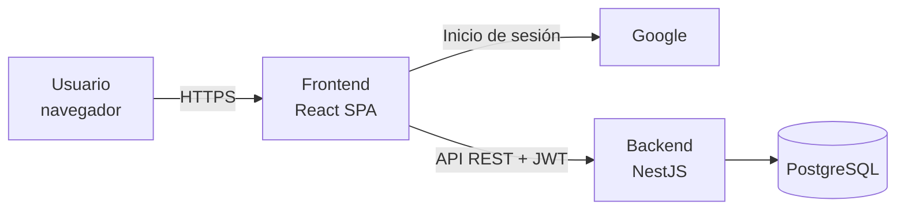
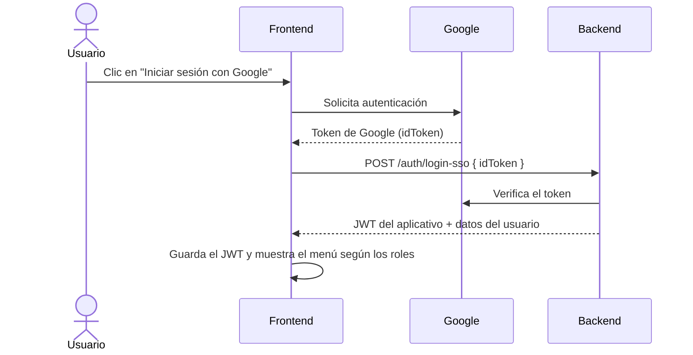
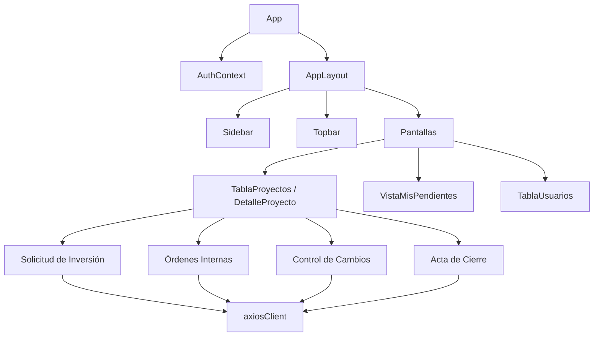
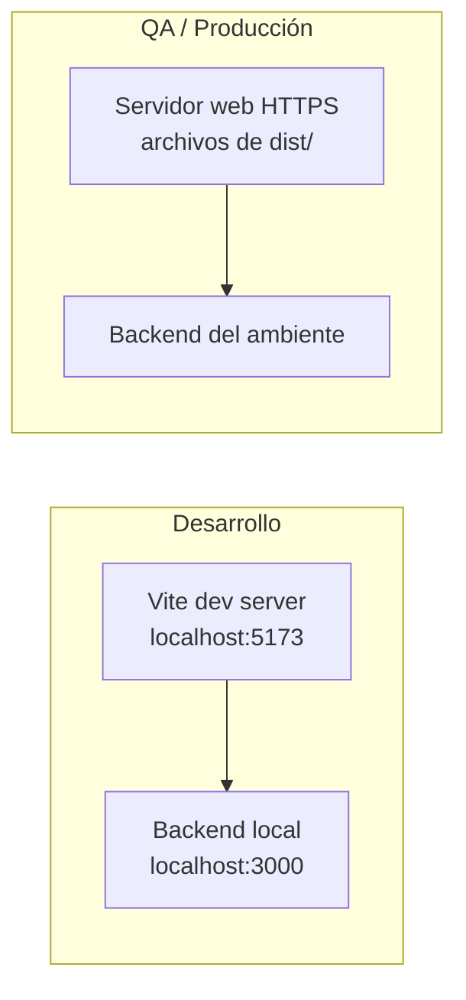

# Flujo CAPEX-OPEX · Frontend (aplicación web)

Interfaz web del aplicativo **Flujo CAPEX-OPEX**, desde donde los usuarios solicitan, revisan, aprueban y consultan los proyectos de inversión de la compañía.

---

## Tabla de contenido

1. [Descripción de la aplicación](#1-descripción-de-la-aplicación)
2. [Introducción](#2-introducción)
3. [Tecnologías empleadas](#3-tecnologías-empleadas)
4. [Librerías usadas](#4-librerías-usadas)
5. [Arquitectura de la aplicación](#5-arquitectura-de-la-aplicación)
6. [Diagramas de la solución](#6-diagramas-de-la-solución)
7. [Arquitectura de ambientes](#7-arquitectura-de-ambientes)
8. [Arquitectura de servicios](#8-arquitectura-de-servicios)
9. [Pruebas automatizadas](#9-pruebas-automatizadas)
10. [Imágenes](#10-imágenes)
11. [Ejemplos de código](#11-ejemplos-de-código)
12. [Instalación](#12-instalación)
13. [Configuración](#13-configuración)
14. [Errores conocidos](#14-errores-conocidos)
15. [Autores](#15-autores)

---

## 1. Descripción de la aplicación

Aplicación web de una sola página (**SPA**) que consume la API REST del backend. Desde ella los usuarios:

| Pantalla | Qué permite |
|---|---|
| **Inicio de sesión** | Entrar con la cuenta corporativa (Google). |
| **Proyectos** | Ver el listado de proyectos, crear uno nuevo, aplazarlo y entrar a su detalle. |
| **Detalle del proyecto** | Ver en un solo lugar todos sus procesos: Solicitud de Inversión, Órdenes Internas, Controles de Cambio y Acta de Cierre. |
| **Solicitud de Inversión** | Diligenciar el formulario (presupuesto, flujo de caja, metas, evaluación financiera) y gestionar su aprobación. |
| **Órdenes Internas** | Crear, enviar, aprobar, rechazar y cerrar órdenes internas. |
| **Control de Cambios** | Solicitar y aprobar cambios del proyecto. |
| **Acta de Cierre** | Cerrar formalmente el proyecto. |
| **Mis pendientes** | Bandeja con los procesos que esperan acción del usuario. |
| **Usuarios** | Administrar usuarios, roles por compañía, área y empresa. |
| **Respaldo** | Descargar la información en Excel (roles autorizados). |

La interfaz muestra a cada usuario **solo las acciones que su rol le permite**. Aun así, el backend vuelve a validar cada permiso.

## 2. Introducción

El aplicativo reemplaza la herramienta anterior construida en **Lotus Domino**, que sale de operación. El objetivo del frontend es ofrecer una experiencia moderna y ordenada **por proyecto**: toda la información de un proyecto y su historial de aprobaciones se consulta desde una sola vista, en lugar de buscar proceso por proceso.

Los usuarios son: Project Managers (PM), PMO, Dirección de PMO, partes interesadas, Gerencia, Presidencia, Control de Gestión, Activos Fijos y administradores.

## 3. Tecnologías empleadas

| Tecnología | Versión | Uso |
|---|---|---|
| React | 19 | Librería de interfaz |
| TypeScript | 6 | Lenguaje |
| Vite | 8 | Servidor de desarrollo y compilación |
| Material UI (MUI) | 9 | Componentes visuales |
| Axios | 1 | Comunicación con la API |
| Node.js | 20 o superior | Solo para desarrollo y compilación |

## 4. Librerías usadas

Las versiones exactas están en `package.json` y `package-lock.json`.

| Librería | Para qué se usa |
|---|---|
| `react`, `react-dom` | Construcción de la interfaz |
| `@mui/material`, `@mui/icons-material` | Componentes visuales e íconos |
| `@emotion/react`, `@emotion/styled` | Motor de estilos que usa MUI |
| `axios` | Peticiones HTTP al backend |
| `react-router-dom` | Enrutamiento (instalada para la navegación por URL) |
| `vite`, `@vitejs/plugin-react` | Desarrollo y compilación |
| `typescript`, `@types/*` | Tipado estático |
| `eslint`, `typescript-eslint`, `eslint-plugin-react-hooks`, `eslint-plugin-react-refresh` | Calidad del código |
| `vitest`, `@vitest/coverage-v8`, `jsdom` | Pruebas automatizadas y cobertura |
| `@testing-library/react`, `@testing-library/user-event`, `@testing-library/jest-dom`, `@testing-library/dom` | Pruebas de componentes como las usa una persona |

## 5. Arquitectura de la aplicación

El frontend está organizado **por funcionalidad** (*feature-based*): cada proceso de negocio tiene su propia carpeta con sus componentes, servicios y tipos.

### Estructura de carpetas

```
.
├── index.html
├── vite.config.ts
├── .env.example              Plantilla de variables de entorno
└── src/
    ├── main.tsx              Punto de entrada
    ├── App.tsx               Navegación entre pantallas
    ├── api/
    │   └── axiosClient.ts    Cliente HTTP: agrega el token y maneja errores globales
    ├── auth/
    │   ├── AuthContext.tsx   Estado de la sesión del usuario
    │   ├── GoogleLoginButton.tsx
    │   └── DevSwitcher.tsx   Selector de usuarios de prueba (solo en desarrollo)
    ├── layout/               Estructura general: Sidebar, Topbar, AppLayout
    ├── components/           Componentes compartidos (encabezados, stepper de etapas)
    ├── theme/                Tema visual de MUI
    └── features/
        ├── inicio/               Bienvenida, sesión cerrada, cuenta desactivada
        ├── proyectos/            Listado, creación y detalle de proyectos
        ├── solicitud-inversion/  Formulario y vista de la SI
        ├── ordenes-internas/     Órdenes Internas
        ├── control-cambios/      Control de Cambios
        ├── acta-cierre/          Acta de Cierre
        ├── procesos/             Bandeja de pendientes
        ├── usuarios/             Administración de usuarios
        └── backup/               Descarga del respaldo
```

### Organización de cada funcionalidad

```
features/<proceso>/
├── components/   Pantallas y componentes visuales
├── services/     Llamadas a la API de ese proceso (usan axiosClient)
├── types/        Tipos de TypeScript de los datos
└── hooks/        Lógica reutilizable (cuando aplica)
```

### Manejo de la sesión

1. El usuario inicia sesión con Google y el frontend envía el token de Google al backend (`POST /auth/login-sso`).
2. El backend responde con su propio **JWT**, que se guarda en el navegador.
3. `axiosClient` agrega ese JWT automáticamente a todas las peticiones.
4. Si el backend responde `401` (sesión vencida o usuario desactivado), `axiosClient` emite un evento y `AuthContext` muestra la pantalla de sesión cerrada.
5. `AuthContext` consulta `GET /auth/me` al abrir la aplicación y al volver a la pestaña, para tener los roles siempre actualizados.

## 6. Diagramas de la solución

### Contexto general



### Flujo de inicio de sesión



### Componentes principales



## 7. Arquitectura de ambientes

| Ambiente | Rama | Cómo se ejecuta |
|---|---|---|
| **Desarrollo (local)** | `development` / `feature/*` | `npm run dev` en `http://localhost:5173` |
| **QA** | `qa` | Archivos compilados (`npm run build`) servidos por un servidor web |
| **Producción** | `master` | Archivos compilados servidos por un servidor web con HTTPS |



Diferencias entre ambientes:

| Aspecto | Desarrollo | QA / Producción |
|---|---|---|
| `VITE_API_URL` | `http://localhost:3000` (valor por defecto) | URL pública del backend |
| Selector de usuarios de prueba (DevSwitcher) | Visible | **No existe**: Vite lo elimina de la compilación |

> Las variables `VITE_*` se incorporan al compilar. Por eso hay que definirlas **antes** de ejecutar `npm run build` en cada ambiente.

## 8. Arquitectura de servicios

El frontend consume la API REST del backend. Cada funcionalidad tiene su archivo de servicios en `features/<proceso>/services/`.

| Funcionalidad | Endpoints del backend que consume |
|---|---|
| Sesión | `/auth/login-sso`, `/auth/me`, `/auth/login-dev` (solo desarrollo) |
| Proyectos | `/proyectos` |
| Solicitud de Inversión | `/solicitud-inversion` |
| Órdenes Internas | `/ordenes-internas` |
| Control de Cambios | `/control-cambios` |
| Acta de Cierre | `/actas-cierre` |
| Pendientes | `/pendientes/mis-pendientes` |
| Usuarios | `/usuarios` |
| Catálogos y compañías | `/catalogos`, `/companias` |
| Respaldo | `/backup/excel` |

El detalle de cada endpoint está documentado en el README del backend.

## 9. Pruebas automatizadas

El frontend tiene pruebas automatizadas con **Vitest** y **React Testing Library**, en `src/test/pruebas/`. Cubren:

- **Funciones y validaciones:** la validación de la Solicitud de Inversión, el manejo de errores y los interceptores de axios.
- **Formularios:** Solicitud de Inversión, Orden Interna, Control de Cambios y Acta de Cierre.
- **Acciones por rol:** aprobar, rechazar, cancelar, elegir gerente o Activos Fijos, y editar partes interesadas.
- **Recorrido completo de la aplicación:** cada rol abre todas las pantallas de cada proyecto, más la gestión de usuarios, Mis Pendientes, el inicio de sesión con Microsoft y Google, y el backup.

**Cómo se simula el backend:** las pruebas no llaman al backend real. Usan respuestas reales que se grabaron del backend para cada rol (`src/test/fixtures/respuestas-api.json`), servidas por un adaptador de axios simulado (`src/test/apiFalsa.ts`).

```bash
npm test           # ejecuta las pruebas
npm run test:cov   # ejecuta las pruebas y genera el reporte de cobertura en coverage/
npm run lint       # revisión de calidad del código (ESLint)
npm run build      # verificación de tipos (TypeScript) y compilación
```

La cobertura combinada (líneas + ramas) es de **89,9 %** (95,3 % de líneas y 83,4 % de ramas). `coverage/` incluye los reportes `lcov.info` y `cobertura-coverage.xml`.

## 10. Imágenes

Capturas del aplicativo (carpeta `docs/imagenes/`):

| Pantalla | Imagen |
|---|---|
| Inicio de sesión |  |
| Listado de proyectos |  |
| Detalle de un proyecto |  |
| Formulario de Solicitud de Inversión |  |
| Mis pendientes |  |

## 11. Ejemplos de código

### Cliente HTTP con el token automático

```ts
// src/api/axiosClient.ts
const axiosClient = axios.create({
  baseURL: import.meta.env.VITE_API_URL || 'http://localhost:3000',
  headers: { 'Content-Type': 'application/json' },
});

axiosClient.interceptors.request.use((config) => {
  const token = localStorage.getItem('token');
  if (token && config.headers) {
    config.headers.Authorization = `Bearer ${token}`;
  }
  return config;
});
```

Cualquier servicio que use `axiosClient` envía el token sin tener que agregarlo a mano.

### Mostrar una acción solo a quien tiene el rol

```tsx
const { tieneRol } = useAuth();

{tieneRol('ADMIN') && (
  <Button variant="contained" onClick={onEditar}>Editar</Button>
)}
```

### Selector de usuarios de prueba solo en desarrollo

```tsx
// src/auth/DevSwitcher.tsx
if (!import.meta.env.DEV) return null;
```

`import.meta.env.DEV` vale `true` con `npm run dev` y `false` en la compilación de producción. Por eso el selector nunca llega a producción.

## 12. Instalación

### Requisitos

- Node.js 20 o superior
- El backend en ejecución (ver README del backend)
- Acceso a `registry.npmjs.org` (o al repositorio interno de paquetes de la compañía)

### Pasos

```bash
# 1. Instalar dependencias
npm ci

# 2. (Opcional en local) crear el archivo de variables
cp .env.example .env

# 3. Iniciar en modo desarrollo
npm run dev
```

La aplicación queda disponible en `http://localhost:5173`.

### Compilar para un servidor

```bash
npm run build
```

Se genera la carpeta `dist/` con archivos estáticos (HTML, JS, CSS) que se publican en cualquier servidor web (nginx, IIS, Azure Static Web Apps, entre otros).

### Scripts disponibles

| Script | Qué hace |
|---|---|
| `npm run dev` | Servidor de desarrollo con recarga automática |
| `npm run build` | Verifica tipos y compila a `dist/` |
| `npm run preview` | Sirve localmente la versión compilada |
| `npm run lint` | Revisa la calidad del código |

## 13. Configuración

Variables en el archivo `.env`, que **no** se sube al repositorio. La plantilla está en `.env.example`.

| Variable | Obligatoria | Descripción |
|---|---|---|
| `VITE_API_URL` | En QA y producción | URL del backend. En local, por defecto `http://localhost:3000` |
| `VITE_GOOGLE_CLIENT_ID` | Solo si se usa Google | Client ID de Google del aplicativo. Si está vacío, no aparece el botón de Google |
| `VITE_MICROSOFT_CLIENT_ID` | Sí, para iniciar sesión con Microsoft | Application (client) ID de la app registrada en Azure (Entra ID). Es el mismo `MICROSOFT_CLIENT_ID` del backend |
| `VITE_MICROSOFT_TENANT_ID` | Sí, para iniciar sesión con Microsoft | Directory (tenant) ID de la empresa en Azure. Es el mismo `MICROSOFT_TENANT_ID` del backend |

> Todo lo que empieza por `VITE_` queda **visible en el navegador**. Nunca se deben poner contraseñas ni secretos en estas variables.

## 14. Errores conocidos

| Síntoma | Causa | Solución |
|---|---|---|
| Error de CORS en la consola del navegador | La URL del frontend no está en `CORS_ORIGIN` del backend | Agregar la URL en `CORS_ORIGIN` |
| No aparece el botón de Google | Falta `VITE_GOOGLE_CLIENT_ID` | Definir la variable y reiniciar `npm run dev` |
| No aparece el botón de Microsoft | Faltan `VITE_MICROSOFT_CLIENT_ID` o `VITE_MICROSOFT_TENANT_ID` | Definir las variables y volver a compilar |
| El popup de Microsoft muestra un error de *redirect URI* | La URL `https://<dominio-del-frontend>/blank.html` no está registrada en Azure | En Azure, registrarla como **Single-page application (SPA)** |
| Aparece "Sesión cerrada" | El token venció (8 horas) o el usuario fue desactivado | Volver a iniciar sesión |
| Mensaje de "Conflicto de concurrencia" | Otro usuario modificó el mismo registro | Recargar la información e intentar de nuevo |
| `npm install` falla con `ETIMEDOUT` o `ECONNRESET` | La red corporativa bloquea `registry.npmjs.org` | Solicitar a TI acceso o la configuración del repositorio interno de paquetes |

**Limitaciones conocidas**
- La navegación no usa URLs por pantalla: al recargar el navegador se vuelve a la pantalla inicial.

## 15. Autores

| Nombre | Rol |
|---|---|
| Yein Alexa Casas Velez | Desarrollo (Practicante de Ingeniería) |
| Isabella Posada Uribe | Analista PMO · Líder funcional |
| Juan David Botero Velez | Director de Ingeniería |
